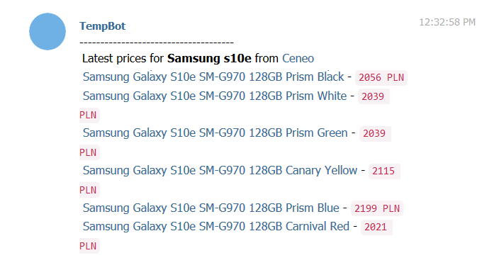

# Ceneo price scrapper

Simple script that checks prices on [Ceneo](https://ceneo.pl) and sends you results via Telegram

## Prerequisites

Before you can use it you need to have 2 things:
	* Telegram Bot's access token
	* Telegram user's id

Helpful links:
	* [How to create Telegram Bot](https://core.telegram.org/bots#6-botfather)

To get your Telegram Bot's access token just follow steps from the link above 

To get your user's id just write something to [Json Dump Bot](https://web.telegram.org/#/im?p=@JsonDumpBot) and save **chat.id**

After you have those two things, save them as environmental variables:
* Windows
	```
	setx TG_BOT_TOKEN "{access_token}"
	```
	```
	setx TG_USER_ID {chat.id}
	```
* Linux
	```
	export TG_BOT_TOKEN="{access_token}"
	```
	```
	export TG_USER_ID={chat.id}
	```
	
### Installing

```
pip install -r requirements.txt
```

### Usage

You can find everything under:

```
python scrapper.py --help
```

If you just want to copy and paste from here:

```
python scrapper.py "Samsung s10e"
```

### Example results

